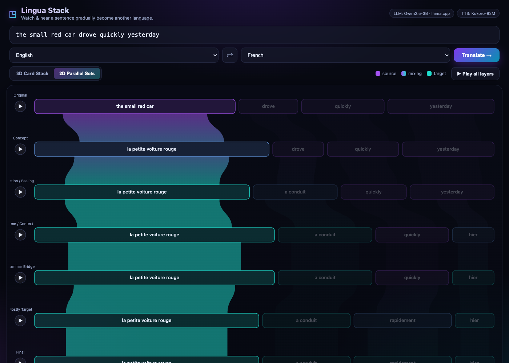

# Field Notes: Building Lingo Bridge

*Building a translator that shows its work — for the Hugging Face Build Small Hackathon.*

## The idea

Every translation app shows you a destination. None of them show you the
*journey*. But translation is a process: meaning crosses first, then actions,
then the little grammar words, and finally the word order rearranges itself into
something natural. I wanted to build a toy that makes that journey **visible and
audible** — a sentence dissolving from one language into another, one coherent
move at a time.

The pitch: *watch and hear a sentence gradually become natural speech in another
language.* The failure mode to avoid: a normal translator wearing a fancy 3D
costume.

## The core decision: don't ask the model to do the hard part twice

The naive approach is to ask an LLM for "seven progressive layers, each split
into chunks, each chunk linked to the previous layer." A 3B model will produce
that — and it will be subtly broken: dangling links, chunks that don't add up,
invalid JSON about a third of the time. Debugging that is a swamp.

So I split responsibility. The model does **one** thing it's genuinely good at:
decompose a sentence into meaningful phrases and align each to its translation.

```json
{
  "final": "Je mangerai le petit déjeuner demain matin",
  "units": [
    {"source": "I will eat", "target": "Je mangerai",       "type": "action",  "order_target": 0},
    {"source": "breakfast",  "target": "le petit déjeuner", "type": "concept", "order_target": 1},
    {"source": "tomorrow morning", "target": "demain matin","type": "time",    "order_target": 2}
  ]
}
```

That's the *entire* JSON contract. One flat list. Everything else — the seven
layers, the colours, the phrase-to-phrase links — is built deterministically in
Python from those units:

- Each phrase **type** flips to the target language at a fixed layer (concept →
  layer 2, action → layer 3, time → layer 4, connectors → layer 5, the rest →
  layer 6). So every layer makes one *coherent* move instead of swapping random
  words. This is the rule that keeps it from being a toy translator with noise.
- Word **order** migrates from the source arrangement to the target arrangement
  near the end. Because a link always connects the *same unit* across adjacent
  layers, reordering shows up automatically as **crossing ribbons** — no special
  case needed.
- Links are valid **by construction**. There is no link that can dangle, because
  links are generated from the units, not parsed from the model.

The payoff: the model's job is small and reliable, the visualization's data is
always well-formed, and the "progressive translation" is a property of the
*system*, not something the model has to remember to do.

## Picking small models that actually run

Target hardware: an M3 MacBook, 16 GB, no NVIDIA GPU. That constraint did the
model selection for me.

- **Text — Qwen2.5-3B-Instruct (GGUF, q4\_k\_m, 2.1 GB) through llama.cpp.**
  Qwen2.5 is the best small *multilingual* family available, and `q4_k_m` runs
  comfortably on Metal. `llama-cpp-python`'s `response_format={"type":
  "json_object"}` plus a one-retry-then-mock guard makes the single structured
  call robust. (Bonus: this satisfies *Llama Champion* and *Off the Grid* at
  once.)

- **TTS — the brief said Qwen3-TTS-0.6B.** It does exist as open weights now
  (`Qwen/Qwen3-TTS-12Hz-0.6B-Base`, Apache-2.0) — but its inference code is
  CUDA-only, with no MPS path. On an M3 it simply won't run. Rather than fake it,
  I wired a real `TTS_ENGINE=qwen3` adapter for anyone with an NVIDIA box, and
  shipped **Kokoro-82M** (`kokoro-onnx`, Apache-2.0, 8 languages, near real-time
  on CPU) as the default so playback works *here, now, offline*. Honest
  engineering beats a checkbox.

Both models are torch-free (`llama.cpp` + `onnxruntime`), which kept the install
light and the memory footprint small.

## The visualization

Two views over the same JSON:

- A **3D card stack** (Three.js, vendored locally for offline use): upright
  translucent glass-metal phrase blocks receding in depth — original at the back,
  final closest to you — connected by broad elevated ribbons that lift off a
  block, arc through the air, and land on the next layer. Reordered phrases cross.
  Colour runs purple (source) → cyan (target) as each phrase flips.
- A **2D parallel-sets** view for fast reading, with the same ribbon bands.

Hovering any phrase traces its whole life across the seven layers; each layer has
a play button, and "Play all" walks down the stack speaking every state.



## What I'd do next

- **More layers differ on short sentences.** With only 3–4 phrases, the last few
  layers can be identical (nothing left to flip). A nice fix: give some units an
  intermediate *gloss/romanization* form so even "stable" phrases visibly settle.
- **Mixed-language TTS.** Each layer is read with one voice; a polyglot layer
  ("Je mangerai le petit déjeuner *tomorrow morning*") would sound better stitched
  from per-phrase voices.
- **Streaming the layers** as the model produces them, instead of all at once.

## Bonus quests landed

*Off-Brand* (custom WebGL/SVG frontend, no Gradio UI), *Off the Grid* (all local,
no cloud), *Llama Champion* (text via llama.cpp), and *Field Notes* (this post).

The thing I'm happiest about: it doesn't feel like a translator. It feels like
watching a sentence *think* its way into another language.
