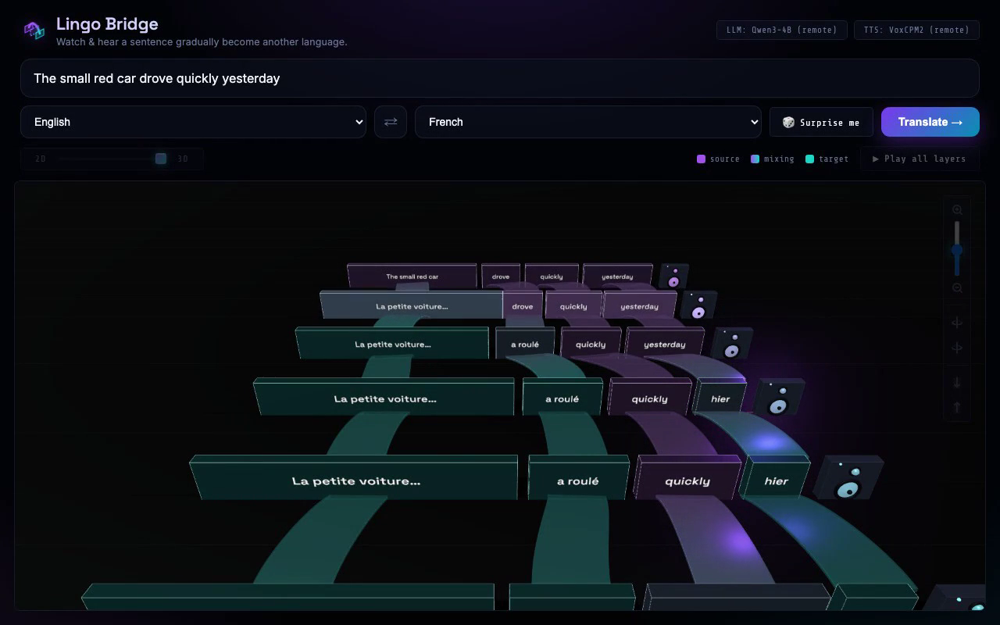

# 🌉 Lingo Bridge

> **Watch and hear** a sentence gradually become another language — phrase by phrase, layer by layer.

Most translators show you a destination. Lingo Bridge shows you the **journey**. It turns one sentence into a **seven-stage transformation** from the source language to the target — meaning crosses first, then actions, then time words, then the grammar glue, and finally the word order rearranges into something natural — rendered as an interactive **3D card stack** and **spoken aloud at every stage**.

It's a language *toy*, not a translator.

## 🎬 Demo

▶ **[Demo video](docs/demo.mp4)**  ·  📣 **[Social post](https://x.com/)** _(link me)_



## How it works

```
sentence ─▶ [Qwen3-4B · llama.cpp] ─▶ one JSON call: aligned phrase "units"
                                          │ {source, target, type, order_target}
                                          ▼
                    Python builds 7 layers deterministically
                    · phrases flip to the target language by TYPE (a schedule)
                    · word order migrates to the target near the end → crossing ribbons
                    · the SAME unit is linked across adjacent layers (valid by construction)
                                          ▼
            custom WebGL/SVG UI (Three.js)  +  [OpenBMB VoxCPM2] speaks each layer
```

A single structured LLM call does the hard part (decompose + align); the seven progressive layers, colours, and phrase links are built in plain Python, so the JSON stays simple and **every connection is valid by construction**. Endpoint layers always read as the exact source / natural-target sentence — only the middle rearranges. See **[BLOG.md](BLOG.md)** for the full write-up.

## 🧠 Models — each well under the 32B cap

| Role | Model | Size | Runtime |
|------|-------|------|---------|
| Text (decompose + align) | [`Qwen/Qwen3-4B-Instruct-2507`](https://huggingface.co/Qwen/Qwen3-4B-Instruct-2507) (Q4_K_M GGUF) | **4B** | **llama.cpp** |
| Speech (per-layer TTS) | [`openbmb/VoxCPM2`](https://huggingface.co/openbmb/VoxCPM2) | **2B** | `voxcpm` (GPU) |

Both are open-weight and run on a single GPU. The text model was empirically validated (10/10) on the decompose-and-align task across all 10 languages.

## 🌍 Languages (10)

English · Spanish · French · Italian · Portuguese · German · Russian · Japanese · Korean · Chinese — any pair, either direction.

## 🏗️ Architecture

A custom **WebGL/SVG frontend** (no default Gradio widgets) is served by FastAPI and **mounted inside a Gradio Space** via `gr.mount_gradio_app` (Docker). Heavy model work runs on a **Modal L4 GPU** (Qwen3-4B via llama.cpp + VoxCPM2), so the Space stays light and scales to zero. The 🎲 *Surprise me* examples are pre-rendered (layers **and** VoxCPM2 audio baked in), so the demo plays instantly with zero model calls.

## 🏆 Tracks, prizes & badges

- **Track — Thousand Token Wood** (a delightful, original, AI-load-bearing toy).
- 🎨 **Off-Brand** — fully custom Three.js UI inside a `gr.mount_gradio_app` Space.
- 🦙 **Llama Champion** — the text model runs through `llama.cpp`.
- 📓 **Field Notes** — [BLOG.md](BLOG.md).
- **Modal** sponsor — GPU backend on Modal (scale-to-zero, cost-guarded).
- **OpenBMB** sponsor — speech by OpenBMB **VoxCPM2**.
- 🐜 **Tiny Titan** — every model is ≤4B parameters.

## ▶️ Run it

**As deployed (Gradio Space, Docker):** the `Dockerfile` builds the app; on a GPU Space it runs Qwen3-4B + VoxCPM2 directly.

**Locally without a GPU** — proxy all model calls to the Modal deployment (no model runs on your machine):

```bash
pip install -r requirements.txt
LINGO_REMOTE_URL="https://uiharu-kazari--lingo-bridge-web.modal.run" \
TTS_ENGINE=remote \
LINGO_TTS_REMOTE_URL="https://uiharu-kazari--lingo-bridge-web.modal.run" \
python3 app.py      # http://127.0.0.1:7860
```

**GPU backend (Modal):**

```bash
modal run   modal_app.py::download_models   # one-time: cache models in a Volume
modal deploy modal_app.py                    # serve Qwen3-4B + VoxCPM2 on an L4
```

## ✅ Submission checklist

- **≤32B per model** — Qwen3-4B (4B) + VoxCPM2 (2B). ✓
- **Gradio app** — custom UI mounted in a Gradio Space (Docker). ✓
- **Demo video** — [docs/demo.mp4](docs/demo.mp4). ✓
- **Social post** — _add link above._ ⬜
- **ZeroGPU limit** — n/a; GPU runs on Modal, not ZeroGPU. ✓

## 🗂️ Project layout

```
config.py       paths, model ids, language set, layer schedule
llm.py          llama.cpp wrapper (+ remote proxy, + mock fallback)
translate.py    decompose+align → build 7 layers + phrase links (+ remote proxy)
tts.py          VoxCPM2 (+ remote proxy, + beep fallback)
examples.py     curated demo sentences      examples_cache.py  precomputed results + audio
app.py          FastAPI API + Gradio-mounted custom UI
modal_app.py    Modal L4 GPU deployment
static/         index.html, style.css, app.js, view3d.js, vendor/three, example_audio/
```
