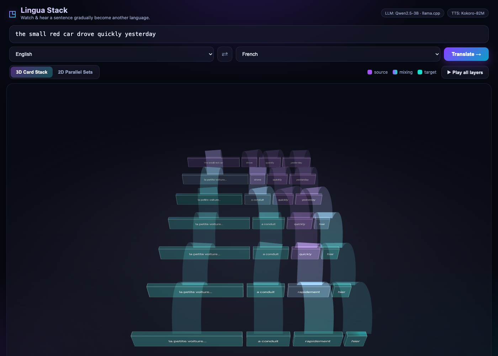
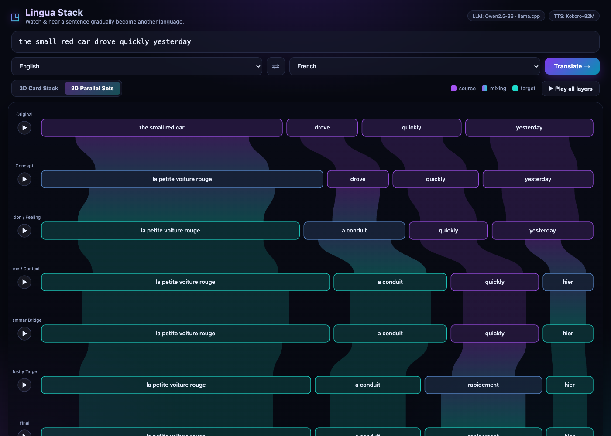

# Lingua Stack — Progressive Translation Card Stack

> Watch **and hear** a sentence gradually become natural speech in another language.

Lingua Stack is an interactive language *toy* for the
[Hugging Face Build Small Hackathon](https://huggingface.co/build-small-hackathon).
Instead of showing only a final translation, it reveals the **seven intermediate
mixed-language states** a sentence passes through — so you can see meaning,
grammar, and word order migrate from the source language to the target,
phrase by phrase.

Everything runs **locally**: a small text model (Qwen2.5-3B via `llama.cpp`) and
a small TTS model (Kokoro-82M via `onnxruntime`). No cloud APIs.




## The seven layers

| # | Layer | What flips to the target language |
|---|-------|-----------------------------------|
| 1 | Original | — (source sentence) |
| 2 | Concept | nouns / people / things / ideas |
| 3 | Action / Feeling | verbs / feelings |
| 4 | Time / Context | when / time expressions |
| 5 | Grammar Bridge | connectors / grammar words |
| 6 | Mostly Target | everything else + word-order migration |
| 7 | Final | the full, natural target sentence |

The key rule: **phrases of the same *type* flip together**, so each layer makes
a semantically/grammatically coherent move — never a random word swap.

## How it works

```
sentence ──► [Qwen2.5-3B / llama.cpp] ──► aligned phrase "units"  (1 JSON call)
                                              │  {source, target, type, order_target}
                                              ▼
                         Python builds 7 layers deterministically
                         · units flip to target by type (schedule)
                         · word order migrates near the end → crossing ribbons
                         · links connect the SAME unit across adjacent layers
                                              ▼
                    FastAPI  ──►  custom WebGL / SVG frontend
                                              ▼
                         [Kokoro-82M / onnxruntime]  speaks each layer
```

A single structured LLM call does the hard part (decompose + align). The seven
progressive layers and every phrase link are then built in plain Python, which
keeps the JSON simple and makes **every connection valid by construction**.

See [`BLOG.md`](BLOG.md) for the full write-up (Field Notes).

## Frontend

A fully custom frontend (no default Gradio UI), served straight from FastAPI:

- **3D Card Stack** — upright translucent glass-metal phrase blocks receding in
  depth (original at the back, final at the front), connected by broad elevated
  ribbons that lift, arc through the air, and land on the next layer. Reordered
  phrases make crossing curves. Built with Three.js (vendored locally).
- **2D Parallel Sets** — the same data as flat rows + ribbon bands, easy to read.
- Gradual **purple → cyan** colorization as phrases cross to the target language.
- **Hover** any phrase to trace its flow across all seven layers.
- **▶ per-layer playback** and **Play all layers** (Kokoro TTS).

## Run it

```bash
./setup.sh     # one-time: installs deps + downloads models (~2.5 GB)
./run.sh       # serves http://127.0.0.1:7860
```

Requires Python 3.10+. On Apple Silicon, `setup.sh` builds `llama-cpp-python`
with Metal. If models are missing the app still runs with a deterministic mock
backend so you can exercise the UI.

## Models

- **Text:** [`Qwen/Qwen2.5-3B-Instruct-GGUF`](https://huggingface.co/Qwen/Qwen2.5-3B-Instruct-GGUF)
  (`q4_k_m`, ~2.1 GB) — strong multilingual instruct model, runs through
  `llama.cpp` with Metal.
- **TTS:** [`hexgrad/Kokoro-82M`](https://huggingface.co/hexgrad/Kokoro-82M)
  via `kokoro-onnx` — Apache-2.0, 8 languages, near real-time on CPU/Apple Silicon.

### A note on Qwen3-TTS

The brief asked for **Qwen3-TTS-0.6B**. It exists as open weights
(`Qwen/Qwen3-TTS-12Hz-0.6B-Base`, Apache-2.0) but ships **CUDA-only** inference
with no Apple-Silicon/MPS path, so it does not run on the M3 this was built on.
An adapter is wired in [`tts.py`](tts.py) (`TTS_ENGINE=qwen3`, needs an NVIDIA
GPU + `pip install qwen-tts`); the default engine is Kokoro-82M so playback
actually works everywhere.

## Hackathon bonus quests

- **Off-Brand** ✅ — custom WebGL/SVG frontend, no default Gradio UI.
- **Off the Grid** ✅ — all models local (llama.cpp + onnxruntime), no cloud APIs.
- **Llama Champion** ✅ — the text model runs through `llama.cpp`.
- **Field Notes** ✅ — [`BLOG.md`](BLOG.md).

## Supported languages

English, Spanish, French, Italian, Portuguese, Japanese, Chinese, Hindi
(any pair, in either direction).

## Project layout

```
config.py      paths, model ids, language map, layer schedule
llm.py         llama.cpp wrapper (+ deterministic mock fallback)
translate.py   decompose+align prompt → build 7 layers + phrase links
tts.py         Kokoro-82M TTS (+ Qwen3-TTS adapter, + beep fallback)
app.py         FastAPI: /api/translate, /api/tts, static frontend
static/        index.html, style.css, app.js, view2d.js, view3d.js, vendor/three
```
